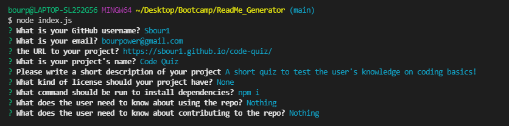
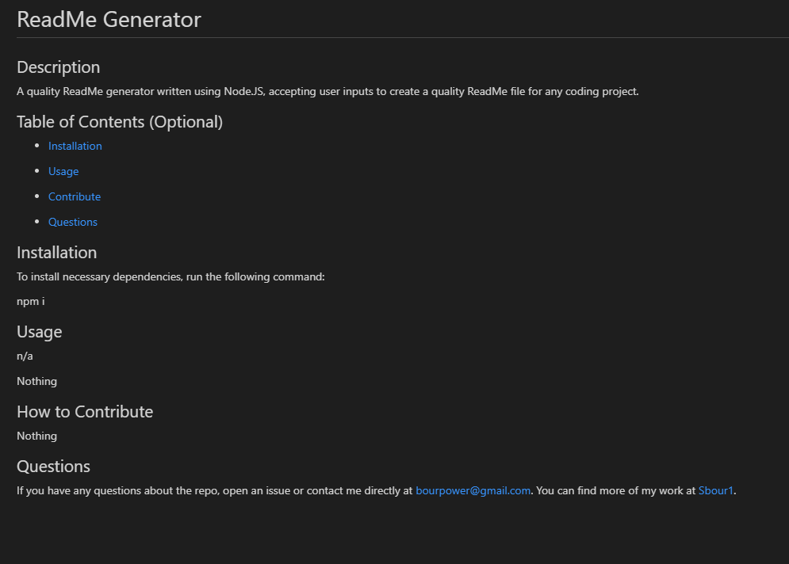

# ReadMe Generator

  ## Description
  
  A quality ReadMe generator written using Node.JS, accepting user inputs to create a quality ReadMe file for any coding project.
  
  ## Table of Contents (Optional)
  
  * [Installation](#installation)
  * [Usage](#usage)
   
  * [Contribute](#contributing)
  * [Testing](#testing)
  * [Questions](#questions)
  
  ## Installation
  
  To install necessary dependencies, run the following command: 

  npm i

  ## Usage

  n/a
  
  Nothing
  
  Demo Video: https://watch.screencastify.com/v/t9ocF97Mo9cEDesrMK8a
  
  

  
  ## How to Contribute
  
  Nothing

  ## Testing
  
  To run tests, run the following command:

  Nothing
  
  ## Questions
  
  If you have any questions about the repo, open an issue or contact me directly at bourpower@gmail.com. You can find more of my work at [Sbour1](https://github.com/Sbour1/).
  
  
  